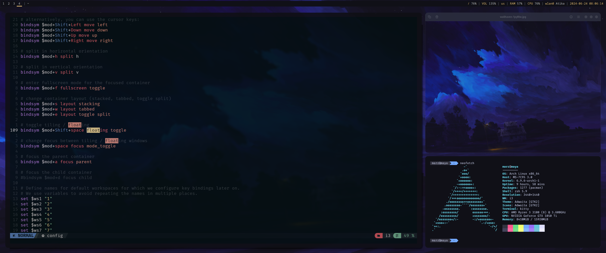

# My Dotfiles

This repository contains my configuration files for Arch Linux with i3, Rofi, Polybar, and Neovim.



## Installation

1. **Clone the repository:**
    ```bash
    git clone https://github.com/yourusername/dotfiles.git
    cd dotfiles
    ```

2. **Create symlinks:**
    ```bash
    ln -s -f ~/dotfiles/ ~/.config/
    ```

3. **Install necessary packages:**
    ```bash
    sudo pacman -S i3 rofi polybar neovim
    ```

4. **Restart i3:**
    ```bash
    i3-msg restart
    ```

## Configurations

- **i3:** `~/.config/i3/config`
- **Rofi:** `~/.config/rofi/config.rasi`
- **Polybar:** `~/.config/polybar/config`
- **Neovim:** `~/.config/nvim/init.vim`
